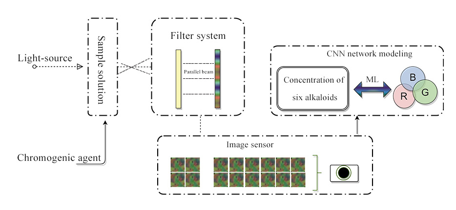
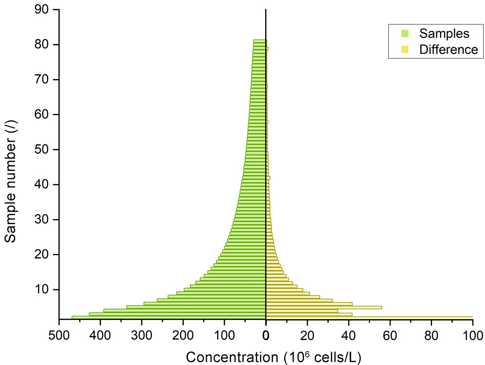
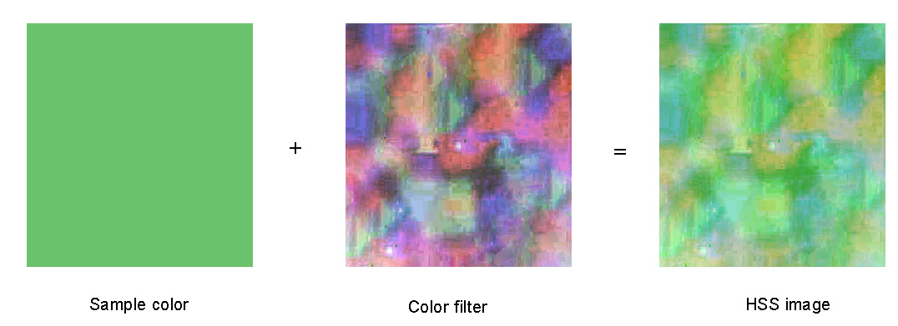

```{r setup, include=FALSE}
knitr::opts_chunk$set(echo = FALSE)
```


# 注

**论文繁长，本处但述大要，示其脉络，未能悉纳，可勿怪耶！**


# 摘要

本研究提出了一种利用化学机器视觉预测藻类密度的新方法，该方法结合了后验光谱技术（PST）和卷积神经网络（CNN），以高效准确地获取藻类密度光谱信息。以铜绿假单胞菌为模型生物模拟富营养化，采用后光谱仪采集2500份样品的光谱图像，分析指示剂浓度的变化。研究了温度、盐度、pH和藻类细胞寿命等因素对光谱采集的影响。评估了模型对地下水、地表水和储层样本的预测性能。主要结论：采用Resnet-50、交叉验证和 $L_2$ 正则化技术对深度学习模型参数进行优化，获取藻类密度光谱信息。研究发现，PST-CNN方法在不同盐度水样中的预测精度不同，其中地下水最高，其次是水库水和地表水。通过混合训练数据提高了高盐度样品的泛化能力和准确性。

# 1. 引言

本研究采用后置光谱仪联合神经网络技术，分析测定三类水体（水库水、地下水、地表水）中蓝藻的藻密度情况，并分析影响蓝藻测定的干扰因素。本法相较于传统检测方法（e.g. 血细胞计数法、流式细胞仪、荧光法和光密度法 etc.)可快速、高效检测蓝藻密度，并无需进行复杂前处理工作，唯一要求提供历史数据以作训练样本。研究思路如下图所示：



# 2. 材料与方法

研究采用自主搭建的后置光谱仪，内置3 W碘钨灯和0.25 W白色LED可发射380-780 nm的可见光，可见光经彩色滤光片而被分为多种色光，再经样品池吸收特定波长的光线，最后剩余光线被CCD相机捕获，形成特定数据光谱；此外，实验选取的浮游藻类为铜绿微囊藻FACHB-905，购自中国科学院水生生物研究所（中国武汉）。在八个500 mL玻璃瓶中配置培养基（引用）并覆盖封口膜密封，在121°C的温度下保持在垂直加热压力蒸汽灭菌器（高压灭菌器）中灭菌3 小时。灭菌溶液在超净工作台上冷却，然后加入10 mL完全生长的铜绿假枝杆菌。将培养瓶置于25°C的恒温培养箱中，在2700 - lx光强度的照明下，每个光照和黑暗循环的替代12小时；

训练所需标签（蓝藻浓度）由计算得来，所需蓝藻浓度分布如下图所示：



实验拍摄所得特异性光谱图片经纠正、剪裁、差值后，即为当前藻浓度对应光谱图，如下图所示。



当实验数据累积到一定数量后，采用ResNet-50模型进行训练；研究采用wolfram公司预先训练的分类网络，稍加改造，即可进行回归预测。进而模型评估方法采用均方根误差 (RMSE)，平均绝对误差 (MAE)，决定系数 (R²)，损失函数 (Loss)以及正则化与交叉验证等方法来评估模型的质量。涉及的公式如下：

$$
R^2 = \left( \frac{{\sum_{i=1}^{N} (x_i - \bar{x})(y_i - \bar{y})}}{{\sqrt{\sum_{i=1}^{N} (x_i - \bar{x})^2 \sum_{i=1}^{N} (y_i - \bar{y})^2}}} \right)^2
$$

$$
RMSE = \sqrt{\frac{{\sum_{i=1}^{N} (x_i - y_i)^2}}{N}}
$$

$$
MAE = \frac{1}{N} \sum_{i=1}^{N} |x_i - y_i|
$$

$$ 
L_2 = λ \sum_{j=1}^{p} w_j^2 + \frac{1}{N} \sum_{i=1}^{N} L(y_i, f(x_i))
$$

```{r message=FALSE}
library(tidyverse)
library(readxl)
library(showtext)
library(latex2exp)
library(patchwork)
library(ggpubr)
library(viridis)
library(ggbeeswarm)
```

# 3. 结果分析

在模型的训练过程中，超参数学习率(lr)与学习回合数(iter)较为关键，本研究采用逐级递进的方法进行讨论。经过对比，选用lr = 0.05，iter = 500的组合，模型学习效果较为良好，训练集与验证集残差均在0处收敛，预测集的残差大致符合正态分布，因此可采用交叉验证方法进一步优化结果。

```{r}
dt0.05_valid <- read_excel("D:/about_R/journal_paper/labelpred_lr=0.05.xlsx",sheet = "valid_set")%>% mutate(res = truth_value1-predict_value1)


dt0.05_valid_loss_tot <- read_excel("D:/about_R/journal_paper/labelpred_lr=0.05.xlsx",sheet = "loss_set") 

dt0.05_valid_loss <- dt0.05_valid_loss_tot %>% select(Round,RoundLoss,ValidationLoss) %>% 
  set_names("Round","dt0.05_valid_RoundLoss","dt0.05_valid_ValidationLoss")

dt0.05_regu_valid <- read_excel("D:/about_R/journal_paper/labelpred_lr=0.05_regu.xlsx",sheet = "valid_set")%>%
  mutate(res = truth_value1-predict_value1,
           predict_class = case_when(predict_value1 >= 100 ~ "Class V",
                                     predict_value1 >= 50 & predict_value1 < 100 ~ "Class IV",
                                     predict_value1 >= 10 & predict_value1 < 50 ~ "Class III",
                                     predict_value1 >= 2 & predict_value1 < 10 ~ "Class II",
                                     predict_value1 >= -1 & predict_value1 < 2 ~ "Class I"),
           truth_class = case_when(truth_value1 >= 100 ~ "Class V",
                                   truth_value1 >= 50 & truth_value1 < 100 ~ "Class IV",
                                   truth_value1 >= 10 & truth_value1 < 50 ~ "Class III",
                                   truth_value1 >= 2 & truth_value1 < 10 ~ "Class II",
                                   truth_value1 >= -1 & truth_value1 < 2 ~ "Class I")
           )  
dt0.05_regu_valid_loss <- read_excel("D:/about_R/journal_paper/labelpred_lr=0.05_regu.xlsx",sheet = "loss_set")%>% select(Round,RoundLoss) %>% 
  set_names("Round","dt0.05_regu_valid_loss")

dt0.05_cross_valid_107.14 <- read_excel("D:/about_R/journal_paper/labelpredVaildLoss=107.149.xlsx",sheet = "valid_set")%>% 
  mutate(res = truth_value1 - predict_value1,
         predict_class = case_when(predict_value1 >= 100 ~ "Class V",
                           predict_value1 >= 50 & predict_value1 < 100 ~ "Class IV",
                           predict_value1 >= 10 & predict_value1 < 50 ~ "Class III",
                           predict_value1 >= 2 & predict_value1 < 10 ~ "Class II",
                           predict_value1 >= -1 & predict_value1 < 2 ~ "Class I"),
         truth_class = case_when(truth_value1 >= 100 ~ "Class V",
                            truth_value1 >= 50 & truth_value1 < 100 ~ "Class IV",
                            truth_value1 >= 10 & truth_value1 < 50 ~ "Class III",
                            truth_value1 >= 2 & truth_value1 < 10 ~ "Class II",
                            truth_value1 >= -1 & truth_value1 < 2 ~ "Class I")
         )
dt0.05_cross_valid_107.14_loss <- read_excel("D:/about_R/journal_paper/labelpredVaildLoss=107.149.xlsx",sheet = "loss_set") %>% 
  set_names("Round","dt0.05_cross_valid_107.14_loss")

dt0.05_cross_valid_34.99 <- read_excel("D:/about_R/journal_paper/labelpredVaildLoss=34.9929.xlsx",sheet = "loss_set") %>% 
  set_names("Round","dt0.05_cross_valid_34.99")


dt_loss <- left_join(dt0.05_valid_loss,dt0.05_regu_valid_loss,by = "Round") %>% 
  left_join(dt0.05_cross_valid_107.14_loss,by = "Round") %>% 
  left_join(dt0.05_cross_valid_34.99,by = "Round")
```

```{r fig.width= 9,fig.align='center'}
dt_loss %>% 
  ggplot()+
  geom_point(mapping =  aes(x = Round,y = dt0.05_valid_RoundLoss,color = "TrainingLoss"))+
  geom_point(mapping = aes(x = Round,y = dt0.05_cross_valid_34.99,color = "ValidationLoss"),alpha = 0.6)+
  ylim(-500,max(dt0.05_valid_loss_tot$ValidationLoss))+
  labs(x = "Iters", y = "Loss",color = NULL,fill = NULL,tag = "A",
       title = "") +
  scale_color_manual(values = c("TrainingLoss" = "#0000FF","ValidationLoss" = "#EE0000"))+
  theme_classic()+
  theme(
    text = element_text(family = "serif"), 
    plot.title = element_text(hjust = 0.5,family = "serif", size = 16, face = "bold"), 
    axis.title.x = element_text(family = "serif", size = 16),  
    axis.title.y = element_text(family = "serif", size = 16),  
    axis.text.x = element_text(family = "serif", size = 16),  
    axis.text.y = element_text(family = "serif", size = 16),   
    legend.text = element_text(size = 14),
    plot.tag = element_text(face = "bold.italic"),
    legend.position = "top") -> Fig3_A

dt0.05_valid %>%
  ggplot(aes(sample = res)) + 
  geom_qq(color = "#76EE00") + 
  geom_qq_line()+
  # scale_y_continuous(limits = c(-10, 10))+
  # scale_x_continuous(limits = c(-2, 2))+
  theme_classic()+
  # coord_fixed()+
  theme(
    legend.position= "",
    plot.title = element_text(hjust = 0.5,size = 16,face = "bold"),
    text = element_text(family = "serif"),
    axis.text.x=element_text(size=16),
    axis.text.y=element_text(size=16),
    axis.title.x=element_text(size=16),
    axis.title.y=element_text(size=16),
    plot.tag = element_text(face = "bold.italic")
  )+
  labs(title = "", x = "Theoretical values",
       y = "Sample values",tag = "B") -> Fig3_B

Fig3_A | Fig3_B
```

研究采用 5 折交叉验证，将2000余份数据随机分割为五份，分别训练，选取最优解作为训练结果。由下图可知道，通过交叉验证方法，预测集残差分布已接近正态随机游走的(图B)，残差与预测值之间无任何关联，理想上达到了上文的目的，但是验证集残差变化则在0 \~ 300出现规律震荡现象，表明模型鲁棒性尚未达至最佳，因此将采用 $L_2$ 正则化方法约束模型参数，防止发生过拟合和拟合不足的产生。

```{r warning=FALSE}
dt0.05_cross_valid_107.14 %>% 
  ggplot(aes(sample = res)) + 
  geom_qq(color = "#76EE00") + 
  geom_qq_line()+
  # scale_y_continuous(limits = c(-10, 10))+
  # scale_x_continuous(limits = c(-2, 2))+
  theme_classic()+
  # coord_fixed()+
  theme(
    legend.position="none",
    plot.title = element_text(hjust = 0.5,size = 16,face = "bold"),
    text = element_text(family = "serif"),
    axis.text.x=element_text(size=16),
    axis.text.y=element_text(size=16),
    axis.title.x=element_text(size=16),
    axis.title.y=element_text(size=16),
    plot.tag = element_text(face = "bold.italic")
  )+
  labs(title = "", x = "Theoretical values",
       y = "Sample values",tag = "B") -> Fig4_B
# Fig4_B

dt_loss %>% 
  ggplot()+
  geom_line(aes(x = Round,y = dt0.05_cross_valid_107.14_loss),color = "#EE0000")+
  theme_classic()+
  theme(
    legend.position="none",
    plot.title = element_text(hjust = 0.5,size = 16,face = "bold"),
    text = element_text(family = "serif"),
    axis.text.x=element_text(size=16),
    axis.text.y=element_text(size=16),
    axis.title.x=element_text(size=16),
    axis.title.y=element_text(size=16),
    plot.tag = element_text(face = "bold.italic")
  )+
  labs(title = "", x = "Iter",
       y = "Loss",tag = "C") -> Fig4_C
# Fig4_C


dt0.05_cross_valid_107.14 %>% 
  ggplot()+
  geom_point(aes(x = predict_value1,y = res,color  = pic_name))+
  scale_y_continuous(limits = c(-5, 10))+
  scale_x_continuous(limits = c(0, 200))+
  scale_color_continuous(low = "#00FF7F",high = "#FF3E96")+
  theme_classic()+
  theme(
    legend.position="",
    plot.title = element_text(hjust = 0.5,size = 16,face = "bold"),
    text = element_text(family = "serif"),
    axis.text.x=element_text(size=16),
    axis.text.y=element_text(size=16),
    axis.title.x=element_text(size=16),
    axis.title.y=element_text(size=16),
    plot.tag = element_text(face = "bold.italic"),
    legend.text = element_text(size=13),
    legend.key.size = unit(0.5, "cm"),
    legend.title = element_text(size = 13)
  )+
  labs(title = "",
       x = TeX(r"($Prediction~(10^6~cell/L)$)"),
       y = TeX(r"($Reduals~(10^6~cell/L)$)"),tag = "A",color = "pic") -> Fig4_A
# Fig4_A

Fig4_A|(Fig4_B/Fig4_C)

```

通过 $L_2$ 正则化方法，我们可以看到，此时验证集残差未出现震荡情况，预测集残差也保持了原有的良好状态，因此，通过多番不同训练方法，我们认为，此时模型训练的结果最接近真实情况。

```{r warning=FALSE}
dt0.05_regu_valid %>% 
  ggplot(aes(sample = res)) + 
  geom_qq(color = "#76EE00") + 
  geom_qq_line()+
  # scale_y_continuous(limits = c(-10, 10))+
  # scale_x_continuous(limits = c(-2, 2))+
  theme_classic()+
  # coord_fixed()+
  theme(
    legend.position="none",
    plot.title = element_text(hjust = 0.5,size = 16,face = "bold"),
    text = element_text(family = "serif"),
    axis.text.x=element_text(size=16),
    axis.text.y=element_text(size=16),
    axis.title.x=element_text(size=16),
    axis.title.y=element_text(size=16),
    plot.tag = element_text(face = "bold.italic")
  )+
  labs(title = "", x = "Theoretical values",
       y = "Sample values",tag = "B") -> Fig5_B
# Fig5_B

dt_loss %>% 
  ggplot()+
  geom_line(aes(x = Round,y = dt0.05_regu_valid_loss),color = "#EE0000")+
  theme_classic()+
  theme(
    legend.position="none",
    plot.title = element_text(hjust = 0.5,size = 16,face = "bold"),
    text = element_text(family = "serif"),
    axis.text.x=element_text(size=16),
    axis.text.y=element_text(size=16),
    axis.title.x=element_text(size=16),
    axis.title.y=element_text(size=16),
    plot.tag = element_text(face = "bold.italic")
  )+
  labs(title = "", x = "Iter",
       y = "Loss",tag = "C") -> Fig5_C
# Fig5_C


dt0.05_regu_valid %>% 
  ggplot()+
  geom_point(aes(x = predict_value1,y = res,color  = pic_name))+
  scale_y_continuous(limits = c(-5, 10))+
  scale_x_continuous(limits = c(0, 200))+
  scale_color_continuous(low = "#00FF7F",high = "#FF3E96")+
  theme_classic()+
  theme(
    legend.position="",
    plot.title = element_text(hjust = 0.5,size = 16,face = "bold"),
    text = element_text(family = "serif"),
    axis.text.x=element_text(size=16),
    axis.text.y=element_text(size=16),
    axis.title.x=element_text(size=16),
    axis.title.y=element_text(size=16),
    plot.tag = element_text(face = "bold.italic"),
    legend.text = element_text(size=13),
    legend.key.size = unit(0.5, "cm"),
    legend.title = element_text(size = 13)
  )+
  labs(title = "",
       x = TeX(r"($Prediction~(10^6~cell/L)$)"),
       y = TeX(r"($Reduals~(10^6~cell/L)$)"),tag = "A",color = "pic") -> Fig5_A
# Fig5_A

Fig5_A|(Fig5_B/Fig5_C)

```

此外，根据《中华人民共和国国家环境保护标准 HJ 1098-2020》中水华分级标准 (下表)，评价模型对于各级水华的识别能力。


| 水华级别 | 藻密度D( $10^6$ cell/L) | 水华特征 |
|:--------:|:-------------------------:|:--------:|
|    I     |           0\~2            |  无水华  |
|    II    |           2\~10           | 明显水华 |
|   III    |          10\~50           | 轻度水华 |
|    IV    |          50\~100          | 中度水华 |
|    V     |           \>100           | 重度水华 |


结果显示，模型对 V 类水的识别最准确，准确率达到0.9，而对I、II 类水的识别则稍显不足，准确率仍然有0.85、0.83，完全适用于生产实践；再者，通过 C 图可以看出，模型的 $R^2$ 达至0.99，再次证明后置光谱仪的可实践性与精密性。

```{r message=FALSE, warning=FALSE,fig.width= 8,fig.align='center',fig.height=8}
dt0.05_cross_valid_107.14  %>% 
  count(truth_class, predict_class) %>%
  group_by(truth_class) %>%
  mutate(acc = n / sum(n)) %>%
  ungroup() %>% 
  filter(truth_class == predict_class) %>% 
  mutate(error = 1 - acc) %>% 
  ggplot(aes(x = truth_class)) +
  geom_bar(aes(y = acc, fill = "Accuracy Rate"), stat = "identity", position = "stack", width = 0.5) +
  geom_bar(aes(y = error, fill = "Error Rate"), stat = "identity", position = "stack", width = 0.5) +
  # scale_fill_manual(values = c("Accuracy Rate" = "#FF3030","Error Rate" = "#00FF00"))+
  scale_x_discrete(labels = c("0-2", "2-10", "20-50", "50-100", "> 100")) + 
  geom_text(aes( y = acc, label = round(acc,2)), position = position_stack(vjust = 0.5), color = "black", size = 4) +
  geom_text(aes( y = error, label = round(error,2)), position = position_stack(vjust = 0.5), color = "black", size = 4)+
  theme_classic()+
  # coord_polar(start = 0) +
  theme(
    legend.position="top",
    plot.title = element_text(hjust = 0.5,size = 16),
    text = element_text(family = "serif"),
    axis.text.x=element_text(size=16),
    axis.text.y=element_text(size=16),
    axis.title.x=element_text(size=16),
    axis.title.y=element_text(size=16),
    plot.tag = element_text(face = "bold.italic"),
    legend.text = element_text(size=13),
    legend.key.size = unit(0.5, "cm"),
    legend.title = element_text(size = 13)
  )+
  labs(title = "", 
       x = TeX(r"($Prediction~(10^6~cell/L)$)"),
       y = "Proportion",tag = "A",fill =  NULL)  +
  coord_flip() -> Fig6_A

# Fig6_A


dt0.05_cross_valid_107.14 %>% 
  ggplot(aes(x = predict_class,y = predict_value1))+
  geom_boxplot(aes(fill = predict_class))+
  # geom_point(aes(color = predict_class))+
  # geom_jitter(width = 0.25)+
  scale_y_log10()+
  theme_classic()+
  scale_x_discrete(labels = c("0-2", "2-10", "20-50", "50-100", "> 100")) +
  theme(
    legend.position="",
    plot.title = element_text(hjust = 0.5,size = 16),
    text = element_text(family = "serif"),
    axis.text.x=element_text(size=16),
    axis.text.y=element_text(size=16),
    axis.title.x=element_text(size=16),
    axis.title.y=element_text(size=16),
    plot.tag = element_text(face = "bold.italic"),
    legend.text = element_text(size=13),
    legend.key.size = unit(0.5, "cm"),
    legend.title = element_text(size = 13)
  )+
  labs(title = "", 
       x = TeX(r"($Prediction~(10^6~cell/L)$)"),
       y = TeX(r"($Prediction~(10^6~cell/L)$)"),tag = "B",fill =  NULL)  +
  coord_flip() -> Fig6_B
# Fig6_B
  # geom_errorbar(stat="summary", fun.data="mean_se", width = 1.5, color = "red", size = 1) 


dt0.05_cross_valid_107.14_lm <- lm(dt0.05_cross_valid_107.14$predict_value1 ~ dt0.05_cross_valid_107.14$truth_value1)

RMSE <-  sqrt(mean((dt0.05_cross_valid_107.14$truth_value1 -dt0.05_cross_valid_107.14$predict_value1)^2))
MAE <-  mean(abs(dt0.05_cross_valid_107.14$truth_value1 -dt0.05_cross_valid_107.14$predict_value1))

dt0.05_cross_valid_107.14 %>%
  filter(predict_value1 <=  quantile(.$predict_value1, 0.85)) %>% 
  ggplot(aes(x = truth_value1,y = predict_value1))+
  geom_point(aes(color = predict_value1))+
  scale_color_gradient2(low = "#0000FF",mid ="chartreuse1" ,high = "#FF0000")+
  geom_smooth(method = "lm", se = TRUE,color = "black")+
  theme_classic()+
  annotate("text",x = 18, y = 60,
           label = paste("y = ", round(coef(dt0.05_cross_valid_107.14_lm)[2], 2)," * ", "x - ",-round(coef(dt0.05_cross_valid_107.14_lm)[1], 2), sep = ""),size = 3,
           family = "serif")+
  annotate("text", x = 15, y = 55,
           label = TeX(r"($R^2 = 0.99$)"),size = 3,family = "serif")+
  annotate("text", x = 15, y = 50,
           label = TeX(r"($RMSE = 6.08$)"),size = 3,family = "serif")+
  annotate("text", x = 15, y = 45,
           label = TeX(r"($MAE = 2.94$)"),size = 3,family = "serif")+
  theme(
    legend.position="",
    plot.title = element_text(hjust = 0.5,size = 16,face = "bold"),
    text = element_text(family = "serif"),
    axis.text.x=element_text(size=16),
    axis.text.y=element_text(size=16),
    axis.title.x=element_text(size=16),
    axis.title.y=element_text(size=16),
    plot.tag = element_text(face = "bold.italic"),
    legend.text = element_text(size=13),
    legend.key.size = unit(0.5, "cm"),
    legend.title = element_text(size = 13)
  )+
  coord_fixed(ratio = 1)+
  labs(tag = "C",
       # title = TeX(r"(Modeling with $L_2$ Regularization)"),
       title = "",
       x = TeX(r"($Observation~(10^6 cell/L)$)"),
       y = TeX(r"($Prediction ~ (10^6 cell/L)$)")) ->   Fig6_C
# Fig6_C

Fig6_A|(Fig6_C / Fig6_B)
```


# 4. 结论

本研究提出一种基于光谱技术和机器学习的快速定量藻密度方法（PST-CNN方法），并在Resnet-50的框架内进行了建模。实验结果表明，盐度是干扰实验的主要因素;不同类型水样的模型预测精度存在差异;并且水样的类型对模型识别水华类有影响。增加数据量和复杂度可以提高预测精度，广义模型可以自动校正盐度对预测结果的影响。